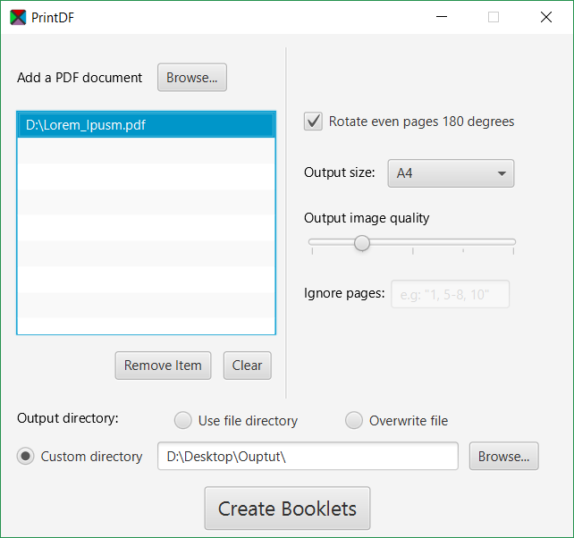

# PrintDF
#### A simple PDF booklet creator. 
Small program to convert PDF documents into printable booklets.

## GUI Program
<b>[Get the latest release here!](https://github.com/Raudius/PrintDF/releases/latest)</b>

### Supports:
* Drag and drop (auto filters for *.pdf)
* 180° rotation on even pages (for some printers)
* Multiple file output options
* Image DPI upscaling for increased quality
* Multiple output page sizes.

### TO-DO:
* Additional (+ custom) page sizes
* Work with inputs that arent of an A(X) page size.
* Ignore set of input pages when creating the booklet
* Create folder if it doesn't exist
* Multi-threadding
